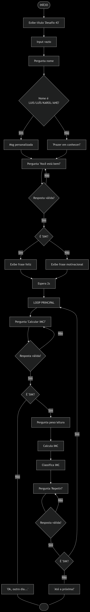
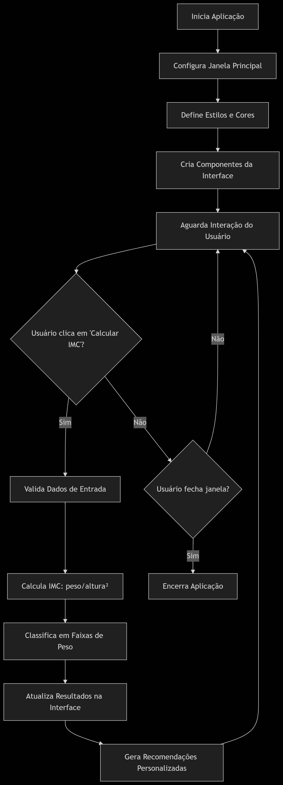

# IMC-calculator

## 🎯 Sobre o Projeto

Este projeto tem como objetivo calcular o IMC (Índice de Massa Corporal) do usuário. Ressaltamos que os resultados obtidos não substituem a avaliação de um profissional da saúde.

###  ⚡ Sobre Mim:

Costumo buscar sempre proporcionar um ambiente de aprendizagem da forma mais didática possível, frequentemente utilizando o ASCE, meu robô educacional. No entanto, desta vez decidi ir além: explorei a ferramenta DeepSeek para desenvolver o front-end do meu projeto, que está integrado ao Tkinker. Ainda assim, deixarei disponível também o projeto que desenvolvi de forma independente, sem auxílio externo. Pretendo continuar utilizando essa inteligência artificial enquanto aprimoro meus conhecimentos em front-end com Python.

###  📌 Desafios e Aprendizados:

Não enfrentei grandes desafios ao desenvolver essa demanda, pois o conceito é relativamente simples. No entanto, o que mais me ocorreu, para ser honesto, foram ideias de como aprimorar e expandir o projeto.

🔮 O Que Vem Por Aí:

Além de aprender a desenvolver o front-end dos meus projetos, pretendo também gerar executáveis (.exe) com ícone personalizado, com o objetivo de facilitar o uso e eliminar a necessidade de uma IDE instalada na máquina do usuário.
Paralelamente, planejo desenvolver uma versão mobile, tornando a aplicação ainda mais acessível e versátil.
Também pretendo incluir uma nova funcionalidade que calcula quanto peso a pessoa precisaria perder para alcançar o peso ideal. Essa função será disponibilizada exclusivamente na versão com interface gráfica (front-end).

###  🔍 Observações Importantes:

Ressalto que a versão com front-end foi desenvolvida com auxílio externo, pois ainda estou em processo de aprendizado nessa área do desenvolvimento em Python. A versão principal do projeto continua sendo a executada via terminal, utilizando o ASCE de forma semelhante a uma conversa em um chat, como no WhatsApp.
Reforço novamente que este programa tem fins educacionais e informativos, e não substitui a avaliação de um profissional da saúde.

## 🗒️✏️ Tabela de Conteúdos

- [Arquitetura](#arquitetura)
- [Features](#features)
- [Contribua com o Projeto](#contribua-com-o-projeto)
- [Extra](#extra)

## **Arquitetura**

## Segue as informções descritivas sobre a versão sem front-end:

### Fluxograma de funcionamento:
```text
INÍCIO
  │
  ├─ Imprimir cabeçalho estético ("Desafio 43")
  │
  ├─ Solicitar entrada vazia (pausa inicial)
  │
  ├─ Solicitar nome do usuário
  │
  ├─ Verificar nome especial:
  │   ├─ Se "LUIS" ou "LUÍS" → Mensagem personalizada
  │   ├─ Se "KAROL" ou "ANE" → Mensagem personalizada
  │   └─ Caso contrário → Mensagem genérica
  │
  ├─ Perguntar estado emocional ("Você está bem?")
  │   ├─ Enquanto resposta ≠ "SIM" ou "NÃO":
  │   │   └─ Solicitar resposta válida
  │   │
  │   ├─ Se "SIM" → Mostrar frase feliz aleatória
  │   └─ Se "NÃO" → Mostrar frase motivacional aleatória
  │
  ├─ Esperar 2 segundos
  │
  └─ LOOP PRINCIPAL:
      │
      ├─ Perguntar se quer calcular IMC
      │   ├─ Enquanto resposta ≠ "SIM", "NÃO" ou "QUERO":
      │   │   └─ Solicitar resposta válida
      │   │
      │   ├─ Se "NÃO" → Sair do loop
      │   │
      │   └─ Se "SIM" ou "QUERO":
      │       │
      │       ├─ Solicitar peso (kg)
      │       ├─ Solicitar altura (m)
      │       ├─ Calcular IMC (peso/altura²)
      │       │
      │       └─ Classificar IMC:
      │           ├─ IMC ≤ 18.5 → "Abaixo do peso"
      │           ├─ 18.5 < IMC ≤ 24.9 → "Peso ideal"
      │           ├─ 25.0 ≤ IMC ≤ 29.9 → "Sobrepeso"
      │           ├─ 30.0 ≤ IMC ≤ 34.9 → "Obesidade grau 1"
      │           ├─ 35.0 ≤ IMC ≤ 39.9 → "Obesidade grau 2"
      │           └─ IMC ≥ 40 → "Obesidade grau 3"
      │
      ├─ Perguntar se deseja repetir
      │   ├─ Enquanto resposta ≠ "SIM" ou "NÃO":
      │   │   └─ Solicitar resposta válida
      │   │
      │   ├─ Se "NÃO" → Mensagem de despedida e sair
      │   └─ Se "SIM" → Reiniciar loop com delay de 2s
      │
      └─ FIM DO LOOP

FIM
```
### Diagrama de funcionamento



```text
1. Importações
python
Copiar código
import time
import random
from datetime import datetime
import math
time: permite usar pausas no programa com time.sleep().

random: permite escolher frases aleatórias com random.choice().

datetime: foi importada, mas não é usada no código.

math: também foi importada, mas não está sendo utilizada neste script.

2. Estética do Título
python
Copiar código
print('{:=^40}'.format('Desafio 43'))
print('{:80}'.format(40 * '='))
Imprime a string "Desafio 43" centralizada com símbolos =.

Depois imprime 40 sinais de igual alinhados à esquerda em uma string de 80 caracteres.

3. Interação Inicial
python
Copiar código
input('')
nome = input('Olaaaa!!!!! Eu me chamo ASCE, como é seu nome? ').strip().upper()
O primeiro input('') serve como pausa.

Em seguida, pergunta o nome do usuário, retira espaços extras e coloca em letras maiúsculas.

4. Saudação Condicional
python
Copiar código
if nome in ['LUIS', 'LUÍS']:
    print('É bom te ver de novo carinha')
elif nome in ['KAROL', 'ANE']:
    print('Fala guria!')
else:
    print('É um prazer te conhecer!!!!')
Dependendo do nome, mostra uma saudação personalizada.

Se o nome não estiver na lista, mostra uma saudação padrão.

5. Listas de Frases
python
Copiar código
frases_feliz = [...]
frases_triste = [...]
Define frases de resposta positivas e motivacionais.

Serão usadas conforme o humor informado pelo usuário.

6. Pergunta sobre Emoção
python
Copiar código
emocao = input('Você está bem? [Sim/Não] ').strip().upper()
while emocao not in ['SIM', 'NÃO']:
    emocao = input('Eu sou meio binário, vai ter que escolher entre SIM e NÃO :D ').strip().upper()
Pergunta se o usuário está bem.

Aceita apenas "SIM" ou "NÃO".

Caso digite outra coisa, o código insiste até a resposta ser válida.

7. Resposta Emocional
python
Copiar código
if emocao == 'SIM':
    print(random.choice(frases_feliz))
else:
    print(random.choice(frases_triste))
Exibe uma frase aleatória baseada na emoção informada.

8. Loop Principal
python
Copiar código
while True:
Cria um loop infinito que será encerrado somente quando o usuário quiser parar.

9. Oferta da Nova Função (IMC)
python
Copiar código
duvida = input(...).strip().upper()
while duvida not in ['SIM', 'NÃO', 'QUERO']:
    duvida = input(...).strip().upper()
Pergunta se o usuário quer ver a nova função (cálculo de IMC).

Aceita apenas as respostas "SIM", "NÃO" ou "QUERO".

Insiste até receber uma resposta válida.

10. Encerramento se Recusar
python
Copiar código
if duvida in ['NÃO']:
    print('Ok, outro dia então...')
    break
Encerra o programa se o usuário não quiser continuar.

11. Cálculo do IMC
python
Copiar código
kg = float(input('Qual é o seu peso? '))
m = float(input('Qual é a sua altura? '))
imc = kg / (m**2)
Recebe o peso e a altura do usuário.

Calcula o IMC com a fórmula padrão.

12. Classificação do IMC
python
Copiar código
if imc <= 18.5:
    print('Você está abaixo do peso ideal')
elif 18.5 < imc <= 24.9:
    print('Você está com o peso ideal')
elif 25.0 <= imc <= 29.9:
    print('Você está com sobre peso')
elif 30.0 <= imc <= 34.9:
    print('Você está com obesidade de 1º grau')
elif 35.0 <= imc <= 39.9:
    print('Você está com obesidade de 2º grau')
else:
    print('Você está com obesidade de 3º grau')
Exibe a faixa correspondente ao valor do IMC do usuário.

Baseia-se nas faixas da OMS.

13. Deseja Repetir?
python
Copiar código
replay = input(...).strip().upper()
while replay not in ['SIM', 'NÃO']:
    replay = input(...).strip().upper()
Pergunta se o usuário deseja calcular novamente.

Insiste até receber "SIM" ou "NÃO".

14. Encerramento ou Reinício
python
Copiar código
if replay == 'NÃO':
    print('\nEspero ter sido útil a você! Até a próxima :D')
    print('{:=^80}'.format(''))
    break
Se o usuário disser que não quer continuar, o programa exibe uma mensagem de despedida e encerra.

python
Copiar código
print('\nReiniciando o código...\n')
time.sleep(2)
Se o usuário quiser repetir, o programa informa e pausa por 2 segundos antes de reiniciar o loop.
```
## Segue as informções descritivas sobre a versão com front-end:
``` text
[INÍCIO]
  │
  ├─> Configura janela (500x700, título, cores)
  │
  ├─> Cria interface:
  │     ├─ Área de título
  │     ├─ Card de entrada (peso/altura)
  │     ├─ Botão calcular
  │     ├─ Card de resultados (IMC)
  │     ├─ Seção de metas
  │     └─ Seção de recomendações
  │
  └─> Loop principal:
        │
        ├─ Aguarda interação
        │
        └─ Se "Calcular" pressionado:
              │
              ├─ Valida entradas
              │   ├─ Se inválido: mostra erro
              │   └─ Se válido:
              │        ├─ Calcula IMC (peso/altura²)
              │        ├─ Classifica em faixas
              │        ├─ Atualiza display
              │        ├─ Calcula metas
              │        └─ Gera recomendações
              │
              └─ Volta ao loop
```
INICIALIZAÇÃO:

Cria janela 900×700 pixels

Configura tema moderno com fonte Montserrat

Define paleta de cores (azul predominante)

INTERFACE:

text

|-------------------------------|
| Lado A: ___  Lado B: ___      |
| Lado C: ___                   |
|                               |
| [ CLASSIFICAR ] (botão azul)  |
|-------------------------------|
| Gráfico | Informações         |
|         |                     |
|---------|---------------------|
FLUXO AO CLASSIFICAR:

Valida se:

Todos valores são números > 0

Satisfazem A+B>C, A+C>B, B+C>A

Classifica por:

Equilátero (3 lados iguais) → Verde

Isósceles (2 lados iguais) → Azul-claro

Escaleno (todos diferentes) → Vermelho

Calcula:

Ângulos internos (Lei dos Cossenos)

Área (Fórmula de Heron)

Perímetro e semiperímetro

Atualiza:

Desenho do triângulo no canvas

Exibe métricas no painel direito

Aplica cor correspondente à classificação

TRATAMENTO DE ERROS:

Entradas inválidas → Mensagem vermelha

Violação da desigualdade triangular → Alerta específico

LOOP PRINCIPAL:

Mantém-se aberto até o usuário fechar a janela

Permite múltiplas classificações seguidas

### Diagrama de funcionamento

   
   
```text
1. Importações
python
Copiar código
import tkinter as tk
from tkinter import ttk, messagebox
import tkinter.font as tkFont
tkinter as tk: importa o módulo principal do tkinter.

ttk: fornece widgets com aparência mais moderna (como ttk.Button, ttk.Entry).

messagebox: permite exibir janelas de alerta e erro.

tkFont: permite configurar fontes personalizadas.

2. Classe Principal - IMCCalculatorUltimate
python
Copiar código
class IMCCalculatorUltimate:
    def __init__(self, root):
A classe representa a aplicação. O método __init__ inicializa a interface.

python
Copiar código
self.root = root
self.root.title("IMC Expert")
self.root.geometry("500x700")
self.root.resizable(False, False)
self.root.configure(bg="#f5f7fa")
Define a janela principal: título, tamanho fixo e cor de fundo.

3. Configuração de estilos e fontes
python
Copiar código
self.style = ttk.Style()
self.style.theme_use('clam')
Define o tema visual.

python
Copiar código
self.title_font = tkFont.Font(family="Segoe UI", size=22, weight="bold")
# As demais linhas seguem o mesmo padrão, mudando tamanho e peso da fonte
Define fontes específicas para diferentes áreas da interface.

4. Dicionário de cores
python
Copiar código
self.colors = {
    "bg": "#f5f7fa",
    "card": "#ffffff",
    ...
}
Centraliza todas as cores usadas no programa para facilitar manutenção e leitura.

5. Chamada de métodos de configuração e interface
python
Copiar código
self.configure_styles()
self.create_widgets()
configure_styles(): configura os estilos dos elementos visuais.

create_widgets(): cria e posiciona todos os elementos da interface.

6. Valores de teste
python
Copiar código
self.weight_entry.insert(0, "82.5")
self.height_entry.insert(0, "1.75")
Insere valores iniciais para teste nos campos de peso e altura.

7. Função configure_styles
Define estilos visuais personalizados para os widgets:

python
Copiar código
self.style.configure('TFrame', background=self.colors["bg"])
# ...continua com mais estilos
8. Função create_widgets
Constrói toda a interface visual:

Canvas com scrollbar

Título e subtítulo

Entradas de peso e altura

Botão de calcular IMC

Resultados

Recomendações

Cada parte é embutida dentro de frames com estilo personalizado para layout e organização.

9. Função calculate_imc
python
Copiar código
def calculate_imc(self):
Captura os valores digitados

Verifica se são válidos (positivos)

Calcula o IMC

Exibe o resultado, classificação e metas

Atualiza as recomendações

Se ocorrer erro na conversão dos dados, exibe uma mensagem de erro com messagebox.

10. Função classify_imc
python
Copiar código
def classify_imc(self, imc):
Retorna uma string de classificação (ex: "Peso normal") e a cor correspondente.

11. Função show_weight_goals
python
Copiar código
def show_weight_goals(self, weight, height, imc):
Calcula metas de peso com base no IMC.

Preenche as linhas do grid com o peso ideal e a diferença em relação ao peso atual.

12. Função show_recommendations
python
Copiar código
def show_recommendations(self, weight, height, imc):
Exibe mensagens diferentes de acordo com a faixa de IMC do usuário.

13. Execução do programa
python
Copiar código
if __name__ == "__main__":
    root = tk.Tk()
Cria a janela principal.

python
Copiar código
# Centralizar a janela na tela
window_width = 500
window_height = 700
screen_width = root.winfo_screenwidth()
screen_height = root.winfo_screenheight()
x = (screen_width // 2) - (window_width // 2)
y = (screen_height // 2) - (window_height // 2)
root.geometry(f"{window_width}x{window_height}+{x}+{y}")
Calcula a posição para centralizar a janela.

python
Copiar código
app = IMCCalculatorUltimate(root)
root.mainloop()
Cria a instância do app e inicia o loop da interface gráfica.
```

## **Features**

### Feature: Interação humanizada com cálculo do IMC
Descrição:
Aplicação de terminal com assistente virtual chamado ASCE, que conversa com o usuário de forma personalizada e realiza o cálculo do IMC com base no peso e altura informados.

Funcionalidades:
Saudações dinâmicas baseadas no nome do usuário.

Interação emocional: frases diferentes dependendo se o usuário está bem ou não.

Cálculo do IMC (Índice de Massa Corporal).

Classificação do IMC de acordo com a OMS:

Abaixo do peso

Peso ideal

Sobrepeso

Obesidade Grau I

Obesidade Grau II

Obesidade Grau III

Validações para respostas fora do padrão (ex: “Sim” ou “Não”).

Permite repetição do cálculo quantas vezes o usuário quiser.

Estilo visual com linhas de separação para melhor apresentação no terminal.

### Feature: Calculadora visual de IMC com metas e recomendações
Descrição:
Aplicação desktop com interface gráfica moderna desenvolvida em Python usando Tkinter, que permite ao usuário calcular o IMC, visualizar metas de peso e receber recomendações de saúde personalizadas.

Funcionalidades:
Interface amigável, responsiva e estilizada com uso de ttk e fontes personalizadas.

Cálculo do IMC a partir do peso e altura fornecidos.

Classificação visual do IMC com destaque de cores:

Abaixo do peso

Peso normal

Sobrepeso

Obesidade Grau I, II ou III

Exibição em tempo real de:

Valor do IMC calculado

Classificação correspondente

Peso ideal baseado em metas (inclusive sugestão de perda ou ganho)

Recomendações específicas com base no resultado do IMC:

Nutrição

Atividade física

Acompanhamento médico

Organização por seções: entrada de dados, resultado, metas e recomendações.

Rolagem automática e centralização da janela para facilitar o uso.

Pré-preenchimento de campos para testes.

Cores temáticas para facilitar a leitura e realçar categorias de risco.

 ## **Contribua com o projeto**

Ele está disponível para versionamento, e caso você tenha alguma idéia legal, ou tenha criado uma versão melhor entre em [contato](https://meu-site-livid-two.vercel.app/), para assim eu divulgar sua versão com o seus créditos.

## **Extra**

Eu espero ter te ajudado de alguma forma, tenha um bom dia, ou tarde, ou noite ou madrugada (prefiro codar de madrugada). 
